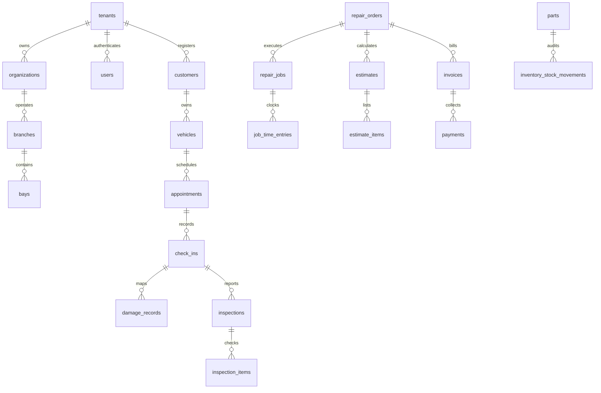

# Database Schema Design

This document outlines the database schema of **AutoForge**, deployed on PostgreSQL.

---

## Entity-Relationship Model

---

## Core Operational Tables

### Tenants (`tenants`)
- `id` UUID PRIMARY KEY (Auto-generated UUIDv4)
- `name` VARCHAR(255)
- `plan` VARCHAR(50) (STARTER, PROFESSIONAL, BUSINESS, ENTERPRISE)
- `status` VARCHAR(50) (ACTIVE, SUSPENDED, DELETED)

### Users (`users`)
- `id` UUID PRIMARY KEY
- `tenant_id` UUID REFERENCES tenants(id)
- `email` VARCHAR(255) UNIQUE
- `password_hash` VARCHAR(255)
- `role` VARCHAR(50) (SUPER_ADMIN, TENANT_ADMIN, SERVICE_ADVISOR, MASTER_TECHNICIAN, TECHNICIAN)
- `status` VARCHAR(50) (ACTIVE, INACTIVE)

### Customers (`customers`)
- `id` UUID PRIMARY KEY
- `tenant_id` UUID REFERENCES tenants(id)
- `name` VARCHAR(255)
- `phone` VARCHAR(50)
- `email` VARCHAR(255)
- `type` VARCHAR(50) (INDIVIDUAL, BUSINESS, FLEET)

### Vehicles (`vehicles`)
- `id` UUID PRIMARY KEY
- `tenant_id` UUID REFERENCES tenants(id)
- `owner_id` UUID REFERENCES customers(id)
- `license_plate` VARCHAR(50)
- `vin` VARCHAR(17) UNIQUE
- `make` VARCHAR(100)
- `model` VARCHAR(100)
- `mileage` INTEGER
- `engine_type` VARCHAR(50) (ICE, HYBRID, PHEV, EV)

### Repair Orders (`repair_orders`)
- `id` UUID PRIMARY KEY
- `tenant_id` UUID REFERENCES tenants(id)
- `ro_number` VARCHAR(100) UNIQUE
- `customer_id` UUID REFERENCES customers(id)
- `vehicle_id` UUID REFERENCES vehicles(id)
- `status` VARCHAR(50) (DRAFT, APPROVED, IN_PROGRESS, READY_FOR_DELIVERY, DELIVERED, CLOSED)

---

## Performance Tuning & Indexes

To support lookup efficiency for millions of vehicles and service histories, the following relational B-Tree indexes are defined:
- `idx_users_tenant` on `users(tenant_id)`
- `idx_customers_tenant` on `customers(tenant_id)`
- `idx_vehicles_license` on `vehicles(license_plate)` (for license plate searches)
- `idx_vehicles_vin` on `vehicles(vin)`
- `idx_repair_orders_number` on `repair_orders(ro_number)`
- `idx_parts_sku` on `parts(sku)`
