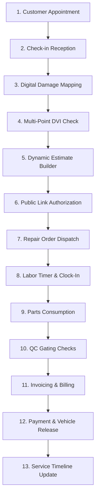

# Core Workshop Workflows

This document describes the AutoForge **Golden Workflow** from customer check-in to vehicle delivery.

---

## The Golden Workflow Sequence

---

## Step-by-Step Execution Rules

### 1. Reception Check-In
- Service advisors inspect the vehicle, verify license plate and odometer reading.
- A visual damage map logs visual defects (scratches, dents, cracks) by recording canvas coordinate offsets.

### 2. Multi-Point Inspection
- The technician follows a checksheet covering Brakes, Tires, Fluids, Electrical, and AC.
- Measurements are registered (e.g. `1.8mm` brake pad thickness).
- Any status below `GOOD` (such as `CRITICAL` or `ATTENTION_SOON`) triggers an automatic repair recommendation.

### 3. Estimating & Consent
- Recommendations convert into Estimate Items (parts + labor costs + standard fees).
- The customer receives a secure, unique URL to review findings, browse photos, and select items they wish to approve.
- A digital sign-off records name, approval status, and timestamp.

### 4. Job Dispatch & Time Clock
- Approved items generate executable `RepairJob` records.
- Technicians check into tasks using a mobile PWA. A ThreadLocal lock validates that **no technician has multiple overlapping timers**.
- Completing jobs registers productive vs. available labor hour metrics.

### 5. Invoicing & Delivery
- Completing all jobs triggers the billing step.
- Approved parts and labor hours compile into a finalized Invoice.
- Payment is logged (Cash, Card, QR) and the RO status transitions to `DELIVERED`, adding the entries to the vehicle's permanent timeline.
